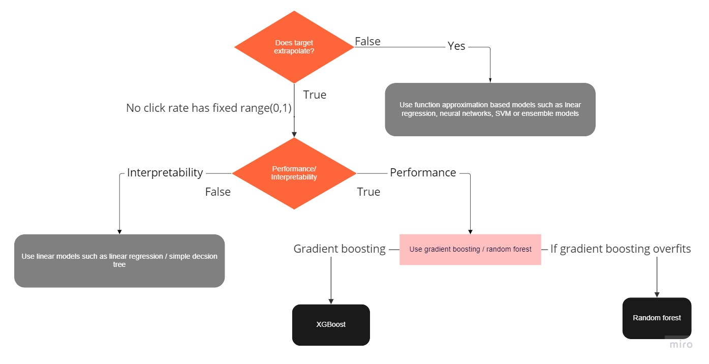
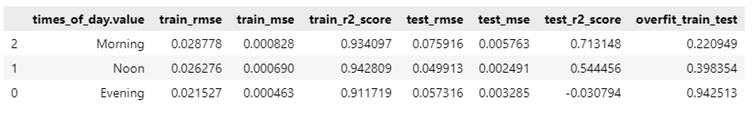

## Analytics Vidhya Jobathon

## Problem Statement:

It is a regression problem where we have to predict the CTR(Click Through Rate) for email campaigns
and therefore identify the critical factors that will help the marketing team to maximize the CTR.

## Notebook link
[google colab - analytics_vidhya_jobathon-email_campaign_ctr_predictions](https://colab.research.google.com/drive/1pYZVfhAkqeGacAaaB51ui5CnDJxmhF6A?usp=sharing)
## Data cleaning

#### Drop columns

* ‘is_timer’ column having 100% zeros
* ‘is_price’ column having 99.3% zeros

#### Below Boolean columns have more than 1 value

* is_image - 6 (likely number of images per email)
* is_quote - 7 (likely number of quotes per email)
* is_emoticons - 6 (likely number of emoticons per email)

  Blindly cleaning the above columns to boolean will lead to loss of information. Instead, let's
create two columns, the first indicating the number of values and the second indicating whether the
column is Boolean.

* number_of_images, is_image
* number_of_qoutes, is_qoute
* number_of_emoticons, is_emoticons

## Feature engineering

Key features using recursive feature elimination
* categorical features:
    *  category
    * product
    * target_audience
* numerical features
    * body_len
    * no_of_CTA
    * mean_paragraph_len
    * mean_CTA_len
    * subject_len

Feature engineering mainly includes 2 types.
* <b>aggregates</b>: aggregate numerical columns using key categorical columns and obtain
descriptive statistics such as mean, median, etc 
Ex: df.groupby(['category,'product']['body_len'].mean())
(average body_len per category and product)
* <b>N-way combination</b>: combining numerical features with other numerical features
    *  Multiplication of features (f1*f2)
    * ratio features (f1/f2)
    * combine features as polynomial features
    
##### Further features were not added since the model was already overfitting.

## Data transformation

[Reversible Data Transforms](https://docs.sdv.dev/rdt) library is used for categorical encoding and data transformation. It
supports
* Automatic datatype detection and transformers
* Conveniently update data types and transformers
* Custom transformers if required
* Supports Fit and transform methods. Hence no data leakage during test transformation.
* Supports convenient reverse data transformation to original data

##### Target transformation was also tried using lognormal, box-cox, and square root. Significant performance improvement was not observed.

## Feature Selection

Feature selection is performed using Recursive Feature Elimination. Selected features are 
[sender, subject_len, body_len, mean_paragraph_len, day_of_week, is_weekend,
times_of_day,category, product, no_of_CTA, mean_CTA_len, is_personalised, is_quote,
target_audience, num_qoutes]

## Modeling
#### Model selection logic

Since the click rate distribution is closer to the Poisson distribution, the Objective function of the
XGBoost model was set Tweedie Regression with tweedie_variance_power 1. However, this did not
make any significant improvement.
Reference: [XGBoost Parameters for Tweedie Regression](https://xgboost.readthedocs.io/en/stable/parameter.html#parameters-for-tweedie-regression-objective-reg-tweedie)

## Train, validation, and test strategy

Since the dataset is small with 1888 data points,
* Use hold out only for testing on unseen data.
* No holdout dataset for validation; instead, cross-validation will be used.
* Will not be able to use early stopping as a result of no validation dataset
* 80% train and 20% test

## Model performance analysis
Added code to check model performance analysis per feature or combined features.
Ex: Model performance based on times_of_day

The model performs decently when times_of_day is morning and poorly when it is evening

## Improvements

The testing strategy was not correct. It was hard to conclude whether specific feature engineering or
transformation improved the model. Maybe instead of using a hold-out set, a complete dataset for
cross-validation with cv=5(80:20 split) would have been a better choice.
